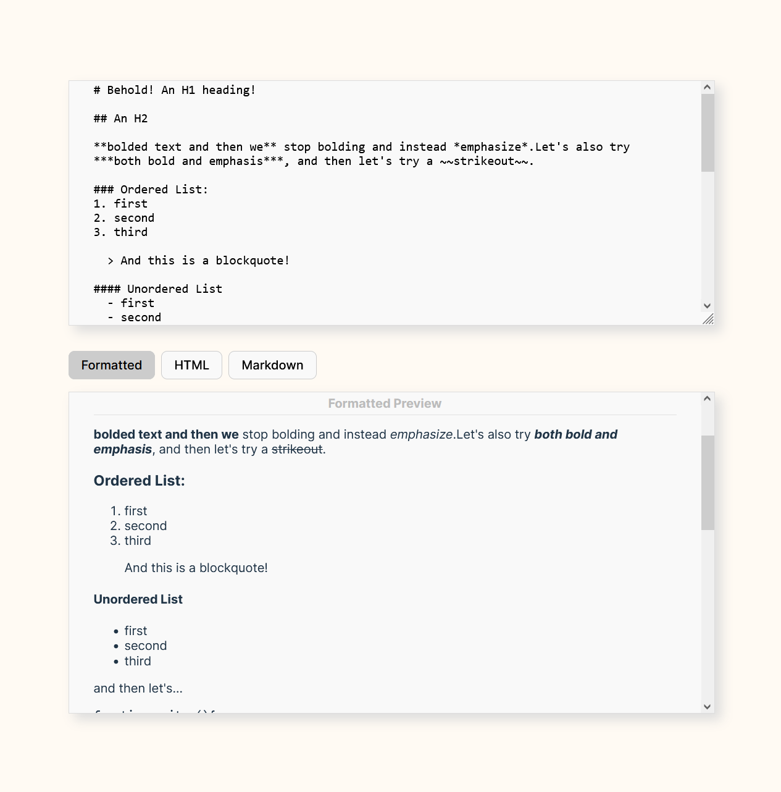

# React WYSIWYG Markdown editor (tip-tap version)

  

This is a very basic component that implements a live "What you see is what you get" (WYSIWYG) Markdown editor in React. I am using the "tip-tap" JavaScript library to accomplish this. 

The point of this is to create an editor that I can use to author blog posts in-browser, and more or less see exactly what the blog post will look like before sending the data for the blog post to be stored on the backend in markdown format. The backend will send the markdown for a specific blog post upon ask, and display it for website visitors in roughly the same way it is displayed in this Editor. 

I am trying out various libraries for this task so I may have other repos with similar WYSIWYG Markdown React editor components available on my Github profile created with different libraries, depending on when you are reading this.
